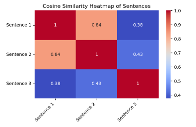

# Deploying ONNX embedding models using Conda Runtime Environment on OCI Model Deployment

Embedding models are quite important in applications related to recommendation systems, semantic search and natural language understanding. Despite their potential, deploying and serving these models efficiently often pose significant challenges, including managing latency, ensuring scalability and maintaining cross-platform compatibility. This is where ONNX models can help, with support for framework agnostic design and optimized performance.

## Overview

This guide walks through the process of serving ONNX embedding models on OCI Data Science platform. We also provide a way to
enable serving the model using the OpenAI compatible route, i.e. `/v1/embeddings` via the OCI Model Deployment service. 
To serve ONNX embedding models, the setup involves the following steps:

- prepare `runtime.yaml` that uses the conda environment with the required packages.
- support for OpenAI spec for embeddings endpoint which can be handled within score.py.
- create model catalog entry with the artifact with the onnx model and the required files (i.e. score.py and runtime.yaml) for conda runtime deployment.
- deploy the model using conda runtime.

## Pre-Requisites
To be able to run the example on this page, ensure you have access to Oracle Data Science notebook in your tenancy. 

### Required IAM Policies

Public documentation for the policies is available [here](https://docs.oracle.com/en-us/iaas/data-science/using/policies.htm).
For this guide, the following policies will need to be added:

##### Generic Model Deployment policies
```
allow group <group-name> to manage data-science-model-deployments in compartment <compartment-name>
allow dynamic-group <dynamic-group-name> to manage  data-science-model-deployments in compartment <compartment-name>
```
##### Emit logs to the Logging service
You need this policy if you’re using Logging in a model deployment.
```
allow any-user to use log-content in tenancy where ALL {request.principal.type = 'datasciencemodeldeployment'}
```
##### Model Store export API 
You'll need this for creating model artifacts greater than 6 GB in size.
You need this policy if you’re using Logging in a model deployment.
```
allow service datascience to manage object-family in compartment <compartment> where ALL {target.bucket.name='<bucket_name>'}
allow service objectstorage-<region> to manage object-family in compartment <compartment> where ALL {target.bucket.name='<bucket_name>'}
```


## Setup

Install dependencies in the notebook session. This is needed to prepare the artifacts, create a model
and deploy it in OCI Data Science.

Run this in the terminal in a notebook session:
```
# install and/or update required python packages
 pip install oracle-ads oci huggingface_hub -U
```

## Prepare the model artifacts

To prepare model artifacts for deployment:

* Download the model files from Hugging Face to local directory using a valid Hugging Face token (only needed for gated models). If you don't have a Hugging Face Token, refer [this](https://huggingface.co/docs/hub/en/security-tokens) to generate one.
* Prepare a local artifact directory for the model folder along with files `runtime.yaml` and `score.py`.
* Include the json schema file `openai.json` since we'll be using the OpenAI spec for input/output for the embedding endpoint.
* Create model catalog entry for the model using ADS SDK.

### Downloading model from Hugging Face Hub

You can refer to [HuggingFace Hub documentation](https://huggingface.co/docs/hub/en/index) for details. Here, we'll deploy one of the most popular embedding models from the hub that is supported by TEI.

Run this in the terminal in a notebook session:
```
# Login to huggingface
huggingface-cli login --token "<your-huggingface-token>"
 
# download the model to local folder. Here, sentence-transformers/all-MiniLM-L6-v2 can be replaced by other models available on Hugging Face Hub.
huggingface-cli download sentence-transformers/all-MiniLM-L6-v2 --local-dir sentence-transformers/all-MiniLM-L6-v2
```

### Prepare local model artifact directory

Create a notebook using the default Python kernel with the Python library specified in the setup section. Add and run the below code to copy the model artifacts downloaded from Hugging Face Hub into a folder
`artifact_dir` within the notebook session.

```python
import os
import shutil

def copy_folder_contents(source_dir, target_dir):
    # ensure the target directory exists
    if not os.path.exists(target_dir):
        os.makedirs(target_dir)
    
    # iterate over the contents of the source directory
    for item in os.listdir(source_dir):
        source_item = os.path.join(source_dir, item)
        target_item = os.path.join(target_dir, item)
        
        # Check if it's a directory or a file
        if os.path.isdir(source_item):
            # recursively copy directory
            shutil.copytree(source_item, target_item)
        else:
            # copy file
            shutil.copy2(source_item, target_item)

# Path to artifact directory for the onnx model
model_artifact_location = os.path.expanduser('./artifact_dir')
os.makedirs(model_artifact_location, exist_ok=True)

model_name = "sentence-transformers/all-MiniLM-L6-v2"
copy_folder_contents(model_name, model_artifact_location)
```

Note that we copy the entire model directory downloaded from HuggingFace with the above code. Since we only need the 
tokenizer and the ONNX model file for a successful deployment, you can update this script to exclude the model files in 
other formats like `.safetensors`, `.bin`, `.gguf`, etc. that are present in this directory.

### Prepare json schema for Embedding API spec

Add the file `openai.json` in the `artifact_dir` with the following contents:

<details>
  <summary>Expand openai.json file</summary>

  ```json
{
    "components":
    {
        "schemas":
        {
            "Embedding":
            {
                "oneOf":
                [
                    {
                        "type": "array",
                        "items":
                        {
                            "type": "number",
                            "format": "float"
                        }
                    },
                    {
                        "type": "string"
                    }
                ]
            },
            "OpenAICompatEmbedding":
            {
                "type": "object",
                "required":
                [
                    "object",
                    "embedding",
                    "index"
                ],
                "properties":
                {
                    "embedding":
                    {
                        "$ref": "#/components/schemas/Embedding"
                    },
                    "index":
                    {
                        "type": "integer",
                        "example": 0,
                        "minimum": 0
                    },
                    "object":
                    {
                        "type": "string",
                        "example": "embedding"
                    }
                }
            },
            "OpenAICompatResponse":
            {
                "type": "object",
                "required":
                [
                    "object",
                    "data",
                    "model",
                    "usage"
                ],
                "properties":
                {
                    "data":
                    {
                        "type": "array",
                        "items":
                        {
                            "$ref": "#/components/schemas/OpenAICompatEmbedding"
                        }
                    },
                    "model":
                    {
                        "type": "string",
                        "example": "thenlper/gte-base"
                    },
                    "object":
                    {
                        "type": "string",
                        "example": "list"
                    },
                    "usage":
                    {
                        "$ref": "#/components/schemas/OpenAICompatUsage"
                    }
                }
            },
            "OpenAICompatUsage":
            {
                "type": "object",
                "required":
                [
                    "prompt_tokens",
                    "total_tokens"
                ],
                "properties":
                {
                    "prompt_tokens":
                    {
                        "type": "integer",
                        "example": 512,
                        "minimum": 0
                    },
                    "total_tokens":
                    {
                        "type": "integer",
                        "example": 512,
                        "minimum": 0
                    }
                }
            },
            "InputType":
            {
                "oneOf":
                [
                    {
                        "type": "string"
                    },
                    {
                        "type": "array",
                        "items":
                        {
                            "type": "integer",
                            "format": "int32",
                            "minimum": 0
                        }
                    }
                ]
            },
            "Input":
            {
                "oneOf":
                [
                    {
                        "$ref": "#/components/schemas/InputType"
                    },
                    {
                        "type": "array",
                        "items":
                        {
                            "$ref": "#/components/schemas/InputType"
                        }
                    }
                ]
            },
            "EncodingFormat":
            {
                "type": "string",
                "enum":
                [
                    "float",
                    "base64"
                ]
            },
            "OpenAICompatRequest":
            {
                "type": "object",
                "required":
                [
                    "input",
                    "model"
                ],
                "properties":
                {
                    "encoding_format":
                    {
                        "allOf":
                        [
                            {
                                "$ref": "#/components/schemas/EncodingFormat"
                            }
                        ],
                        "default": "float"
                    },
                    "input":
                    {
                        "$ref": "#/components/schemas/Input"
                    },
                    "model":
                    {
                        "type": "string",
                        "example": "sentence-transformers/all-MiniLM-L6-v2"
                    },
                    "user":
                    {
                        "type": "string",
                        "example": "null",
                        "nullable": true
                    }
                }
            }
        }
    }
}  
```
</details>

To enable the model deployment endpoint to serve the embedding model using `/v1/embeddings` endpoint, we use a json schema and add some processing 
logic within `score.py`. This json schema enforces the contract for the embedding request and the content of this json schema comes from Text Embedding Inference's [github repo](https://github.com/huggingface/text-embeddings-inference/blob/main/docs/openai.json).

Next, add the below `score.py` file in your home directory or the location where the notebook is created. Heere, the inputs 
are validated using the json schema. Also, the tokenizer needs to be a part of the model artifact as we would not be able to download it from HuggingFace without internet access within the model deployment VM. 
After receiving the response from the deployed model, we do some post-processing to send the response in the right format.


<details>
  <summary>Expand score.py file</summary>

  ```python
import os
import sys
import json
from functools import lru_cache
import onnxruntime as ort
import jsonschema
from jsonschema import validate, ValidationError
from transformers import AutoTokenizer

model_name = 'model.onnx'
openai_schema = 'openai.json'


"""
   Inference script. This script is used for prediction by scoring server when schema is known.
"""


@lru_cache(maxsize=10)
def load_model(model_file_name=model_name):
    """
    Loads model from the serialized format

    Returns
    -------
    model:  a model instance on which predict API can be invoked
    """
    model_dir = os.path.join(os.path.dirname(os.path.realpath(__file__)), 'onnx')
    if model_dir not in sys.path:
        sys.path.insert(0, model_dir)
    contents = os.listdir(model_dir)
    if model_file_name in contents:
        model = ort.InferenceSession(os.path.join(model_dir, model_file_name), providers=['CUDAExecutionProvider', 'CPUExecutionProvider'])
        return model
    else:
        raise Exception(f'{model_file_name} is not found in model directory {model_dir}')


@lru_cache(maxsize=1)
def load_tokenizer():
    # initialize tokenizer
    return AutoTokenizer.from_pretrained(os.path.dirname(os.path.realpath(__file__)), clean_up_tokenization_spaces=True)

@lru_cache(maxsize=1)
def load_openai_schema():
    """
    Loads the input schema for the incoming request

    Returns
    -------
    schema:  openai schema as json
    """
    model_dir = os.path.dirname(os.path.realpath(__file__))
    try:
        with open(os.path.join(model_dir, openai_schema), 'r') as file:
            return json.load(file)
    except:
        raise Exception(f'{openai_schema} is not found in model directory {model_dir}')
    

def validate_inputs(data):
    """
    Helper function to validate if the inputs conforms to the OpenAI /v1/embeddings format.
    """
    api_schema = load_openai_schema()
    # use a reference resolver for internal $refs
    resolver = jsonschema.RefResolver.from_schema(api_schema)
    # get the actual schema part to validate against
    request_schema = api_schema["components"]["schemas"]["OpenAICompatRequest"]
    try:
        # validate the input JSON
        validate(instance=data, schema=request_schema, resolver=resolver)
    except ValidationError as e:
        example_value = {
            "input": ["What are activation functions?"], 
            "encoding_format": "float", 
            "model": "sentence-transformers/all-MiniLM-L6-v2",          
            "user": "user"
        }
        message = f"JSON is invalid. Error: {e.message}\n An example of the expected format for 'OpenAICompatRequest' looks like: \n {json.dumps(example_value, indent=2)}"
        raise ValueError(message) from e
    

def pre_inference(data):
    """
    Preprocess data

    Parameters
    ----------
    data: Data format as expected by the predict API.

    Returns
    -------
    onnx_inputs: Data format after any processing
    total_tokens: total tokens that will be processed by the model

    """
    validate_inputs(data)
    tokenizer = load_tokenizer()
    inputs = tokenizer(data['input'], return_tensors="np", padding=True)
    
    padding_token_id = tokenizer.pad_token_id
    total_tokens = (inputs["input_ids"] != padding_token_id).sum().item()
    onnx_inputs = {key: [l.tolist()for l in inputs[key] ] for key in inputs}
    
    return onnx_inputs, total_tokens

def convert_embeddings_to_openai_format(embeddings, model, total_tokens):
    """
    Helper function to get onnx embeddings output and convert to OpenAI format. Currently, encoding_format is ignored and
    float is used as default.
    """
    formatted_data = []
    for idx, embedding in enumerate(embeddings):
        formatted_embedding = {
            "object": "embedding",
            "embedding": embedding,
            "index": idx
        }
        formatted_data.append(formatted_embedding)

    # create the final OpenAICompatResponse format
    openai_compat_response = {
        "object": "list",
        "data": formatted_data,
        "model": model,  # Use the provided model name
        "usage": {
            "prompt_tokens": total_tokens,  # represents the token count for just the text input
            "total_tokens": total_tokens     # total number of tokens involved in the request, same in case of embeddings
        }
    }
    
    return openai_compat_response


def post_inference(outputs, model, total_tokens):
    """
    Post-process the model results

    Parameters
    ----------
    outputs: Data format after calling model.run
    model: name of model
    total_tokens: total tokens that will be processed by the model

    Returns
    -------
    outputs: Data format after any processing.

    """
    results = [embed.tolist() for embed in outputs]
    response = convert_embeddings_to_openai_format(results, model, total_tokens)
    return response

def predict(data, model=load_model()):
    """
    Returns prediction given the model and data to predict

    Parameters
    ----------
    model: Model instance returned by load_model API.
    data: Data format as expected by the predict API of the core estimator. For eg. in case of sckit models it could be numpy array/List of list/Pandas DataFrame.

    Returns
    -------
    predictions: Output from scoring server
        Format: {'prediction': output from model.predict method}

    """
    # inputs contains 'input_ids', 'token_type_ids', 'attention_mask' but 'token_type_ids' is optional
    inputs, total_tokens = pre_inference(data)
    
    onnx_inputs = [inp.name for inp in model.get_inputs()]
    embeddings = model.run(None, {key: inputs[key] if key in inputs else None for key in onnx_inputs})[0]
    
    response = post_inference(embeddings, data['model'], total_tokens)
    return response 
```
</details>


### Create Model Catalog Entry

We first set up the variables needed for creating and deploying the model.

```python
import ads
ads.set_auth("resource_principal")
 
model_file = os.path.join(model_artifact_location, "onnx/model.onnx")

artifact_path = f"oci://<bucket>@<namespace>/{model_name}"
project_id="<project_ocid>"
compartment_id = "<compartment_ocid>"
 
log_group_id = "ocid1.loggroup.oc1.xxx.xxxxx"
log_id = "cid1.log.oc1.xxx.xxxxx"

sentences = ["The car sped down the highway at an incredible speed.", 
             "A vehicle raced along the freeway, moving very fast.", 
             "The child was playing in the park with a ball."]
```

Using ads, prepare the model artifacts to be uploaded to Model Catalog. The `prepare()` method will generate a 
`runtime.yaml` and copy the custom `score.py` in the `artifact_dir` folder. All these files along with the ONNX model 
artifacts will be zipped and uploaded to the Model Catalog. 

```python
from ads.model.generic_model import GenericModel

model = GenericModel(model_file_name=model_file,
                     artifact_dir="artifact_dir",
                     estimator=None,
                     serialize=False,
                     model_input_serializer="json")


model.prepare(
    inference_conda_env="oci://bucket@namespace/conda_environments/gpu/path/to/onnx/env",
    inference_python_version="3.12",
    model_file_name=model_file,
    score_py_uri="score.py",
    force_overwrite=True,
)
```

### Verify and Save the Model

Once model artifacts are prepared, we can verify locally to check if the inference works fine. An `InterfaceSession` 
object is needed to create a session connection to the ONNX model, provided by `onnxruntime`. Since our `score.py` references both
`CUDAExecutionProvider` and `CPUExecutionProvider` for inference, the former is used if the notebook session uses a GPU instance, 
otherwise it defaults to using CPU for inference. 

```python

output = model.verify({"input": sentences, 
                       "model": model_name})
```
The verify method should return the embeddings for the inputs provided. The `.verify()` method takes a set of test 
parameters and performs the prediction by calling the predict function in `score.py`.

Once the result looks good, call `.save()` to pack and upload the artifacts under `artifact_dir` to OCI data science 
model catalog. Once the artifacts are successfully uploaded, you should be able to see the OCID of the model.

```python
model_id = model.save(display_name=model_name)
```
If the `artifact_dir` size is greater than 2Gb, then we need to use a `bucket_uri` where the intermediate zipped 
artifact is temporarily saved before it is uploaded to Model Catalog to avoid timeouts for larger file upload.

```python
model_id = model.save(display_name=model_name,
                     bucket_uri=f"oci://bucket_name@namespace/prefix")
```

### Deploy the Embedding Model

We can deploy this model either on a CPU or a GPU instance, accordingly set the parameters in the `deploy()` function.

```python

deploy = model.deploy(
    display_name=f"{model_name} deployment",
    deployment_log_group_id="ocid1.loggroup.oc1.<region>.<ocid>",
    deployment_access_log_id="ocid1.log.oc1.<region>.<ocid>",
    deployment_predict_log_id="ocid1.log.oc1.<region>.<ocid>",
    deployment_instance_shape="VM.GPU.A10.1",
)
```
or 
```python

model.deploy(
    display_name=f"{model_name} deployment",
    deployment_log_group_id="ocid1.loggroup.oc1.<region>.<ocid>",
    deployment_access_log_id="ocid1.log.oc1.<region>.<ocid>",
    deployment_predict_log_id="ocid1.log.oc1.<region>.<ocid>",
    deployment_instance_shape="VM.Standard.E4.Flex",
    deployment_ocpus=4,
    deployment_memory_in_gbs=64,
)
```
It usually takes a few minutes to deploy the model, and you should see the model deployment information in the output 
once the deployment is complete.

### Run Inference

Once the model is deployed successfully and has reached the Active State, we can run inference using `predict()`. 

```python
model.predict({"input": sentences, "model": model_name})

```
Alternatively, we can invoke the model deployment endpoint directly as follows:

```python
import requests
 
endpoint = f"https://modeldeployment.{region}.oci.customer-oci.com/{deployment.model_deployment_id}/predict"
 
response = requests.post(
    endpoint,
    json={
        "input":sentences
    },
    auth=ads.common.auth.default_signer()["signer"],
    headers={},
).json()
```

The raw output (response) has an array of three lists with embedding for the above three sentences.

```json
{'object': 'list',
 'data': [{'object': 'embedding',
   'embedding': [-0.00735207,
    -0.045759525,
    0.061242294,
    0.013910536,
    0.048454784,
    -0.0059445454,
    0.007921069,
    0.029093834,
    0.04836494,
    ...
    ...
    ...
    -0.005862751,
    0.055649005],
   'index': 2}],
 'model': 'sentence-transformers/all-MiniLM-L6-v2',
 'usage': {'prompt_tokens': 39, 'total_tokens': 39}}
```

### Testing Embeddings generated by the model

Here, we have 3 sentences - two of which have similar meaning, and the third one is distinct. We'll run a simple test 
to find how similar or dissimilar these sentences are, using cosine similarity as a comparison metric.

```python
from sklearn.metrics.pairwise import cosine_similarity
import matplotlib.pyplot as plt
import seaborn as sns
 
embeddings = [sentence['embedding'] for sentence  in response['data']]
similarity_matrix = cosine_similarity(embeddings)
 
labels = [f"Sentence {i+1}" for i in range(len(sentences))]
 
# visualize the similarity matrix using a heatmap
plt.figure(figsize=(6, 4))
sns.heatmap(similarity_matrix, annot=True, cmap='coolwarm', xticklabels=labels, yticklabels=labels)
 
# add title and labels for better clarity
plt.title('Cosine Similarity Heatmap of Sentences')
plt.xticks(rotation=45, ha='right')
plt.yticks(rotation=0)
plt.tight_layout()
plt.show()
```




The above heatmap shows that the embedding model captures the semantic similarity between the first two sentences while distinguishing the third as different.


